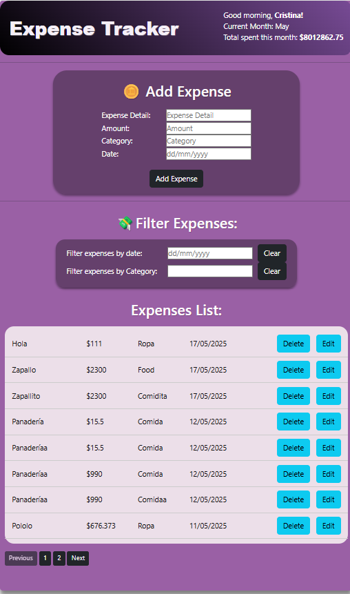

# ExpenseTrackerFrontEnd

A frontend web application for tracking expenses, built with React.

## Overview

ExpenseTrackerFrontEnd is the user interface for the Expense Tracker system. It allows users to view, add, edit, and delete expenses and categories by communicating with the backend REST API.

## Technologies Used

- React (with functional components and hooks)  
- Axios for HTTP requests  
- CSS (or a CSS framework, if you're using one)  
- React Router (if navigation is implemented)

## Getting Started

### Prerequisites

- Node.js and npm installed on your machine  
- The backend API should be running (see: [ExpenseTrackerBackend](https://github.com/candreanivera/ExpenseTrackerBackend))

### Installation

1.⭐ Clone the repository:
   git clone https://github.com/candreanivera/ExpenseTrackerFrontEnd.git

2.⭐ Navigate to the project folder:
    cd ExpenseTrackerFrontEnd

3.⭐ Install dependencies:
    npm install

4.⭐ Running the App
    Start the development server:
    npm start

    Then open your browser and go to:
    http://localhost:3000

5.⭐ Configuration
    Make sure to update the API base URL in your code (typically in an Axios config file or environment variable) to point to your backend, such as:

    http://localhost:5000/api

6.⭐ Features
    View list of expenses
    Add new expenses
    Edit or delete existing entries
    Clean, responsive UI

7.⭐ Notes
    Ensure CORS is enabled on the backend if you're running both frontend and backend separately.

    You can deploy this project using platforms like Vercel, Netlify, or GitHub Pages.

